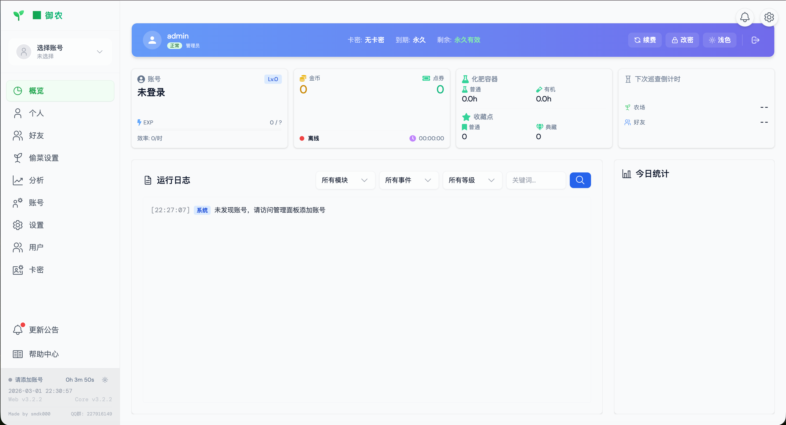
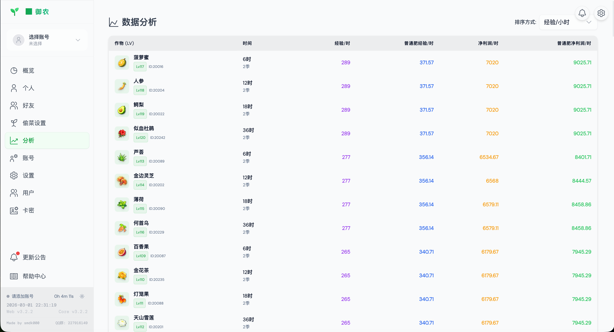
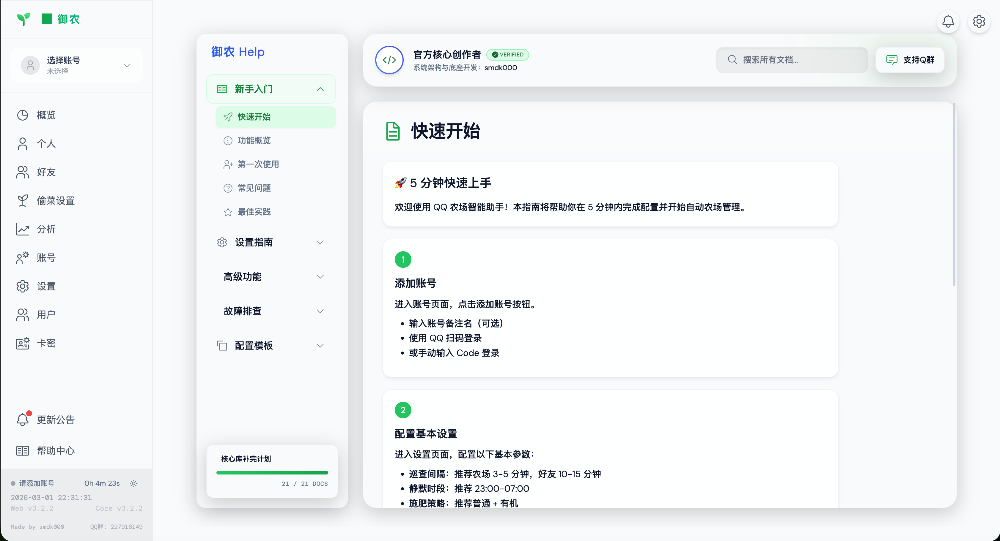
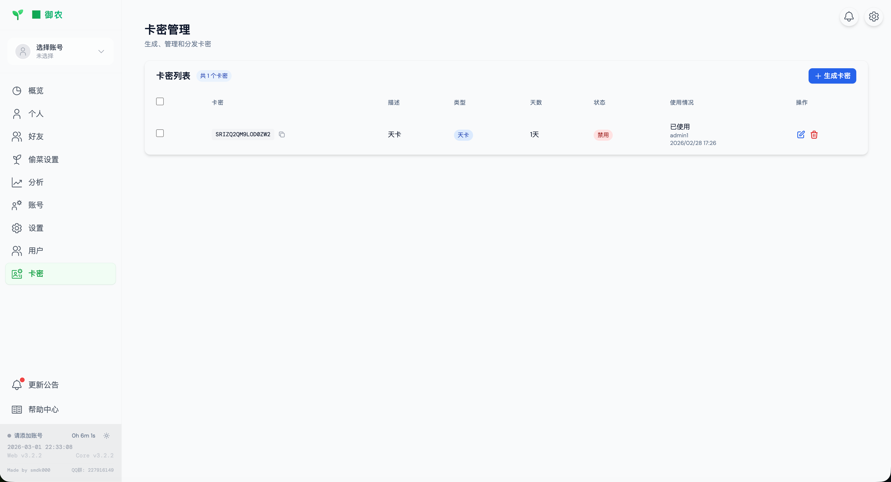
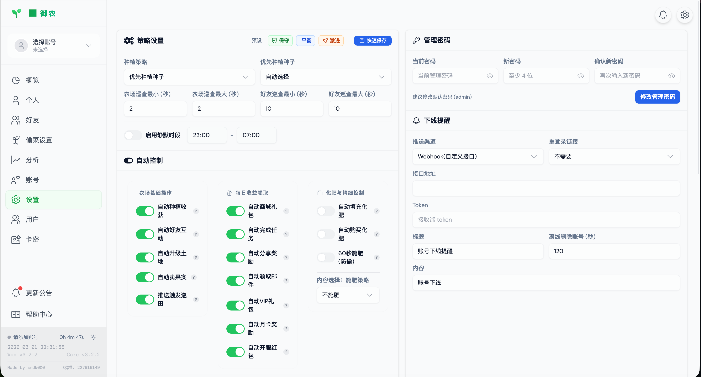
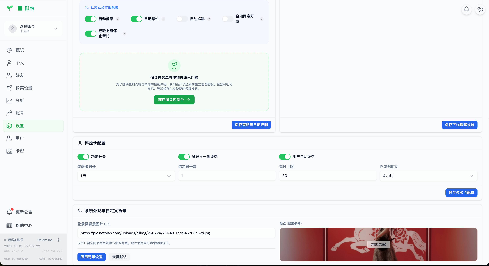

# QQ 农场智能助手 - 多账号挂机 + Web 面板

基于 Node.js 的 QQ 农场自动化工具，支持多账号管理、Web 控制面板、实时日志与数据分析。


---

## 技术栈

### 后端技术

**核心框架**
- **运行时**: Node.js 20+ (推荐 Node.js 22+)
- **Web 框架**: Express 4.21.0
- **实时通信**: Socket.io 4.8.3
- **HTTP 客户端**: Axios 1.16.0

**数据库与存储**
- **主数据库**: MySQL 8.0 (mysql2 3.18.2)
- **缓存**: Redis (ioredis 5.10.0)
- **本地存储**: SQLite (better-sqlite3 12.6.2) - 离线模式
- **协议缓冲**: Protobuf.js 8.0.0 (腾讯 QQ 农场私有协议)

**日志与通知**
- **日志框架**: Winston 3.18.3
- **推送服务**: pushoo 0.1.11 (支持 Bark、Webhook 等)

**打包与部署**
- **打包工具**: pkg 5.8.1 (跨平台二进制打包)
- **支持平台**: Windows x64, Linux x64, macOS x64/arm64

[](https://nodejs.org/)
[](https://expressjs.com/)
[](https://socket.io/)
[](https://www.mysql.com/)
[](https://redis.io/)
[](https://www.sqlite.org/)

### 前端技术

**核心框架**
- **框架**: Vue 3.5.28 (Composition API)
- **构建工具**: Vite 7.3.1
- **语言**: TypeScript 5.9.3
- **状态管理**: Pinia 3.0.4
- **路由**: Vue Router 5.0.3
- **HTTP 客户端**: Axios 1.13.5
- **WebSocket**: Socket.io-client 4.8.3
- **工具库**: @vueuse/core 14.2.1

**UI 与样式**
- **原子化 CSS**: UnoCSS 66.5.12
- **图标**: 
  - @iconify-json/carbon 1.2.18
  - @iconify-json/fa-solid 1.2.2
  - @iconify-json/svg-spinners 1.2.4
- **重置样式**: @unocss/reset 66.5.12

**开发与质量**
- **类型检查**: vue-tsc 3.2.5
- **代码规范**: 
  - ESLint 9.39.1
  - @antfu/eslint-config 7.4.3
  - eslint-plugin-format 1.4.0
- **可视化分析**: rollup-plugin-visualizer 7.0.0
- **压缩插件**: vite-plugin-compression 0.5.1

[](https://vuejs.org/)
[](https://vitejs.dev/)
[](https://www.typescriptlang.org/)
[](https://pinia.vuejs.org/)
[](https://unocss.dev/)

### 部署与 DevOps

**容器化**
- **Docker**: Docker Compose v2+
- **多平台构建**: Docker Buildx (linux/amd64, linux/arm64)
- **镜像仓库**: 
  - Docker Hub: smdk000/qq-farm-bot-ui
  - GitHub Container Registry: ghcr.io/smdk000/qq-farm-bot-ui

**包管理**
- **包管理器**: pnpm 10.30.2
- **工作空间**: pnpm workspace

**CI/CD**
- **GitHub Actions**: 自动构建、测试、发布
- **自动发布**: GitHub Releases 自动上传二进制文件
- **镜像同步**: 自动推送到 Docker Hub 和 GHCR

[](https://www.docker.com/)
[](https://pnpm.io/)
[](https://github.com/features/actions)

---

## 功能特性

### 多账号管理
- 账号新增、编辑、删除、启动、停止
- 扫码登录（支持 QQ 与 微信）与手动输入 Code
- 账号被踢下线自动删除
- 账号连续离线超时自动删除
- 账号离线推送通知（支持 Bark、自定义 Webhook 等）

### 自动化能力
- **农场管理**：收获、种植、浇水、除草、除虫、铲除、土地升级
- **仓库管理**：收获后自动出售果实
- **好友互动**：自动偷菜 / 帮忙 / 捣乱
- **任务系统**：自动检查并领取任务奖励
- **智能防护**：
  - 好友黑名单：跳过指定好友
  - 静默时段：指定时间段内不执行好友操作
  - 60 秒防偷抢收保护
  - 两季作物智能识别

### Web 面板
- 概览 / 农场 / 背包 / 好友 / 分析 / 账号 / 设置 / 帮助中心页面
- 实时日志，支持按账号、模块、事件、级别、关键词、时间范围筛选
- 深色 / 浅色主题切换
- 响应式设计，支持移动端访问



### 分析页
支持按以下维度排序作物：
- 经验效率 / 普通肥经验效率
- 净利润效率 / 普通肥净利润效率
- 等级要求



### 帮助中心
- 新手入门指南
- 详细设置说明
- 高级功能教程
- 故障排查指南
- 配置模板推荐



---

## 环境要求

### 源码运行
- **Node.js**: 20+ (推荐 Node.js 22+)
- **包管理器**: pnpm 10+ (推荐通过 `corepack enable` 启用)
- **可选数据库**: 
  - MySQL 8.0+ (生产环境推荐)
  - Redis 6.0+ (缓存加速，可选)

### 二进制发布版
- **无需安装 Node.js**
- 直接从 GitHub Releases 下载对应平台的可执行文件

### Docker 部署
- **Docker**: Docker Engine 20+
- **Docker Compose**: v2+
- **支持架构**: 
  - linux/amd64 (Intel/AMD 服务器)
  - linux/arm64 (树莓派/鲲鹏/飞腾/Apple Silicon)

---

## 快速启动

### 🚀 一键启动（推荐）

**Linux/macOS:**
```bash
./start.sh
```

**Windows:**
```cmd
start.bat
```

### 手动启动

#### Windows

```powershell
# 1. 安装 Node.js 20+（https://nodejs.org/）并启用 pnpm
node -v
corepack enable
pnpm -v

# 2. 安装依赖并构建前端
cd D:\Projects\qq-farm-bot-ui
pnpm install
pnpm build:web

# 3. 启动
pnpm dev:core

# （可选）设置管理密码后启动
$env:ADMIN_PASSWORD="你的强密码"
pnpm dev:core
```

#### Linux（Ubuntu/Debian）

```bash
# 1. 安装 Node.js 20+
sudo apt update && sudo apt install -y curl
curl -fsSL https://deb.nodesource.com/setup_20.x | sudo -E bash -
sudo apt install -y nodejs
corepack enable

# 2. 安装依赖并构建前端
cd /path/to/qq-farm-bot-ui
pnpm install
pnpm build:web

# 3. 启动
pnpm dev:core

# （可选）设置管理密码后启动
ADMIN_PASSWORD='你的强密码' pnpm dev:core
```

启动后访问面板：
- 本机：`http://localhost:3000`
- 局域网：`http://<你的 IP>:3000`



---

# 🐳 跨平台 Docker 一键部署指南 (V3 终局版)

本项目全架构拥抱 Docker 化并原生支持 **linux/amd64 (x86_64)** 与 **linux/arm64**，搭载强隔离式 MySQL 与 Redis 的完整集群体系。

## 🚀 推荐：单行脚本一键部署 (App + MySQL + Redis)

无论您使用的是 Intel/AMD 服务器、还是类似甲骨文/树莓派等 ARM 架构的机器，请直接在终端中执行以下命令：

```bash
curl -fsSL https://raw.githubusercontent.com/smdk000/qq-farm-ui-pro-max/main/deploy.sh -o deploy.sh && chmod +x deploy.sh && ./deploy.sh up
```

**该脚本的魔力在于：**
1. 自动探明您的服务器系统架构，智能拉取匹配的底层容器。
2. 自动为您由于环境缺失而补充安装 Docker 与 Docker Compose。
3. **（重要）**在侦测到 ARM 架构（如 aarch64）时，将自动开启 `vm.overcommit_memory=1` 释放系统内存限额，防止 Redis 等依赖无故崩溃。
4. 全自动在当前目录生成 `.env` 安全脱敏配置模板供后期微调。

---

## 🛠 方法二：使用原生 Docker Compose 编排启动

如果您属于经验丰富的开发者并希望保持环境的纯净独立掌控权：

**1. 下载完整编排配置并生成 `.env`**
```bash
curl -O https://raw.githubusercontent.com/smdk000/qq-farm-ui-pro-max/main/docker-compose.yml
curl -o .env https://raw.githubusercontent.com/smdk000/qq-farm-ui-pro-max/main/.env.example
```

**2. 定制您的服务密码（强烈防黑客推荐）**
您可以使用 `nano` 或 `vim` 编辑 `.env` 文件，任意修改 `ADMIN_PASSWORD`、数据库密文及相关系统级验证 Key（如 `WX_API_KEY`）。

**3. 后台独立启动服务矩阵**
```bash
docker-compose up -d
```

---

## 🛡️ 数据安全与防丢失挂载声明

我们极端挂念所有农友的心血数据，为您做出了以下物理层面级的保障：
- **MySQL 核心** 将被自动挂载于宿主机同级目录下的 `./mysql_data`。
- **Redis 高速缓存** 映射至 `./redis_data` 并强制启用 AOF 增量同步断电续存。
- **App 热配置** 落盘于 `./data` 中进行本地留痕冷备安全。

> [!TIP]
> 部署完成片刻后，当您通过 `docker ps` 看到 `qq-farm-app`、`qq-farm-mysql`、`qq-farm-redis` 军均处于 **Up (healthy)** 状态时，即代表部署大功告成！

**现在，请在浏览器访问主节点：`http://<服务器外网IP>:3000`**
## 多用户模式

## 多用户模式

### 管理员操作

#### 1. 生成卡密
1. 登录管理员账号（默认：admin / admin）
2. 进入"卡密"页面
3. 点击"生成卡密"
4. 选择类型：天卡 (D) / 周卡 (W) / 月卡 (M) / 永久卡 (F)
5. 设置天数和数量
6. 生成并分发卡密

#### 2. 用户管理
1. 进入"用户"页面
2. 查看用户列表
3. 编辑用户（修改到期时间、启用/封禁）
4. 删除普通用户


### 普通用户操作

#### 注册账号
1. 在登录页面切换到"注册"标签
2. 输入用户名和密码
3. 输入卡密
4. 点击"注册并登录"

#### 账号续费
1. 登录后在 Dashboard 查看用户信息
2. 点击"续费"按钮
3. 输入新卡密
4. 确认续费



---

## 偷菜过滤配置

### 设置步骤
1. 进入"设置"页面
2. 选择要配置的账号
3. 找到"偷菜过滤设置"
4. 启用偷菜过滤
5. 选择过滤模式：
   - **黑名单**：不偷选中的蔬菜
   - **白名单**：只偷选中的蔬菜
6. 勾选蔬菜
7. 保存设置

### 好友过滤
1. 进入"设置"页面
2. 选择账号
3. 找到"偷好友过滤设置"
4. 启用好友过滤
5. 选择过滤模式
6. 勾选好友（需先加载好友列表）
7. 保存设置



---

## 二进制发布版（无需 Node.js）

### 下载预编译版本

**从 GitHub Releases 下载**:
访问 https://github.com/smdk000/qq-farm-ui-pro-max/releases 下载对应平台的可执行文件。

| 平台 | 文件名 |
|------|--------|
| Windows x64 | `qq-farm-bot-win-x64.exe` |
| Linux x64 | `qq-farm-bot-linux-x64` |
| macOS Intel | `qq-farm-bot-macos-x64` |
| macOS Apple Silicon | `qq-farm-bot-macos-arm64` |

### 运行

**Windows**:
```cmd
# 双击 exe 文件或在终端执行
.\qq-farm-bot-win-x64.exe
```

**Linux / macOS**:
```bash
# 赋予执行权限并运行
chmod +x ./qq-farm-bot-linux-x64
./qq-farm-bot-linux-x64
```

### 访问

启动后访问：`http://localhost:3000`

- **默认用户名**: `admin`
- **默认密码**: `admin`

### 数据存储

程序会在可执行文件同级目录自动创建 `data/` 并写入 `farm-bot.db` 数据库文件。

⚠️ **重要**: 不要删除 `data/` 目录，否则数据将丢失。

---

### 自行编译

如果您想从源码编译二进制版本：

```bash
# 1. 安装依赖
pnpm install

# 2. 构建前端
pnpm build:web

# 3. 打包二进制文件
pnpm package:release
```

产物输出在 `core/dist/` 目录。

---

## 登录与安全

- 面板首次访问需要登录
- 默认管理密码：`admin`
- **建议部署后立即修改为强密码**
- 支持 Token 认证机制
- 用户状态实时验证（封禁/过期自动踢出）

---

## 项目结构

```
qq-farm-bot-ui/
├── core/                  # 后端（Node.js 机器人引擎）
│   ├── src/
│   │   ├── config/        # 配置管理
│   │   ├── controllers/   # HTTP API
│   │   ├── database/      # 数据库迁移脚本
│   │   ├── gameConfig/    # 游戏静态数据
│   │   ├── models/        # 数据模型与持久化
│   │   ├── proto/         # Protobuf 协议定义
│   │   ├── runtime/       # 运行时引擎与 Worker 管理
│   │   └── services/      # 业务逻辑（农场、好友、任务等）
│   ├── data/              # 运行时数据（farm-bot.db）
│   └── client.js          # 主进程入口
├── web/                   # 前端（Vue 3 + Vite）
│   ├── src/
│   │   ├── api/           # API 客户端
│   │   ├── components/    # Vue 组件
│   │   ├── stores/        # Pinia 状态管理
│   │   └── views/         # 页面视图
│   └── dist/              # 构建产物
├── pic/                   # 文档图片
├── docs/                  # 详细文档
├── docker-compose.yml
├── pnpm-workspace.yaml
└── package.json
```

---

## 核心架构

### 运行时架构

```
┌─────────────────────────────────────────┐
│           主进程 (client.js)            │
│  ┌─────────────────────────────────┐    │
│  │   运行时引擎 (Runtime Engine)   │    │
│  │  ┌──────────┐  ┌──────────┐    │    │
│  │  │ Worker 1 │  │ Worker 2 │    │    │
│  │  │ (账号 1)  │  │ (账号 2)  │    │    │
│  │  └──────────┘  └──────────┘    │    │
│  └─────────────────────────────────┘    │
└─────────────────────────────────────────┘
           │                │
           ▼                ▼
    ┌─────────────┐  ┌─────────────┐
    │  Express    │  │  Socket.io  │
    │  HTTP Server│  │  WebSocket  │
    └─────────────┘  └─────────────┘
           │                │
           ▼                ▼
    ┌─────────────────────────────────┐
    │      Vue 3 Web 面板 (前端)       │
    └─────────────────────────────────┘
```

### 数据流

#### MySQL/Redis 架构（生产环境）
```
用户操作 → Web 面板 → HTTP API → DataProvider → Worker
                                           ↓
                                      游戏服务器
                                           ↓
                          ┌────────────────┴────────────────┐
                          ↓                                 ↓
                    MySQL 数据库                      Redis 缓存
                    (持久化存储)                    (热点数据/锁)
```

#### SQLite 架构（单机/离线模式）
```
用户操作 → Web 面板 → HTTP API → DataProvider → Worker
                                           ↓
                                      游戏服务器
                                           ↓
                                    SQLite 数据库
                                    (本地存储)
```

---

## 数据库架构

### 数据库架构演进

#### v3.8.0+ - MySQL/Redis 架构（生产环境推荐）
- **主数据库**: MySQL 8.0 - 存储用户、账号、配置、日志等核心数据
- **缓存层**: Redis 6.0+ - 高频数据缓存、分布式锁、Pub/Sub 通信
- **优势**: 
  - 高并发支持（多用户同时访问）
  - 数据持久化与备份
  - 分布式部署能力
  - 性能优化（Redis 缓存热点数据）

#### v3.7.x 及之前 - SQLite 架构（单机/离线模式）
- **本地数据库**: SQLite (better-sqlite3)
- **适用场景**: 
  - 单机部署
  - 离线模式
  - 轻量级使用
- **特性**: 
  - WAL 模式（预写日志）
  - 自动检查点合并
  - 忙等待超时保护

### 核心表结构（MySQL）

- **users** - 用户信息表
  - 用户名、密码（SHA256）、角色、创建时间、到期时间
  
- **cards** - 卡密表
  - 卡密代码、类型（D/W/M/F）、天数、使用状态、使用时间
  
- **accounts** - 账号配置表
  - 账号 ID、QID、密码（加密）、备注、所有者、创建时间
  
- **account_configs** - 账号配置表
  - 自动化开关、偷菜过滤、静默时段、蹲守设置等
  
- **operation_logs** - 操作日志表
  - 账号 ID、操作类型、时间戳、结果、耗时
  
- **config_audit_logs** - 配置审计日志
  - 配置变更历史、时间戳、操作者
  
- **friend_lists** - 好友列表缓存
  - 账号 ID、好友列表、更新时间
  
- **farm_data** - 农场数据缓存
  - 账号 ID、农田状态、作物信息、成熟时间

---

## 特别感谢

- 核心功能：[linguo2625469/qq-farm-bot](https://github.com/linguo2625469/qq-farm-bot)
- 部分功能：[QianChenJun/qq-farm-bot](https://github.com/QianChenJun/qq-farm-bot)
- 扫码登录：[lkeme/QRLib](https://github.com/lkeme/QRLib)
- 推送通知：[imaegoo/pushoo](https://github.com/imaegoo/pushoo)
- 主体框架：[Penty-d/qq-farm-bot-ui](https://github.com/Penty-d/qq-farm-bot-ui)

---

## 常见问题

### Q1: 如何添加账号？
A: 登录管理面板后，进入"账号"页面，点击"添加账号"，支持扫码登录或手动输入 QID 和密码。

### Q2: 账号离线了怎么办？
A: 系统会自动检测账号离线状态，并发送推送通知（如果已配置）。可以手动重启账号或等待自动重连。

### Q3: 如何配置偷菜过滤？
A: 进入"设置"页面，选择账号后找到"偷菜过滤设置"，可以选择黑名单或白名单模式，并勾选相应的植物或好友。

### Q4: 数据库如何备份？
A: 数据库文件位于 `core/data/farm-bot.db`，直接复制该文件即可。系统会在迁移时自动创建备份到 `core/data/backup/` 目录。

### Q5: 如何查看日志？
A: 在 Dashboard 页面可以查看实时日志，支持按账号、模块、事件、级别等维度筛选。

---

## 开发指南

### 本地开发

```bash
# 安装依赖
pnpm install

# 启动后端（监听模式）
pnpm dev:core

# 启动前端（热重载）
pnpm dev:web
```

### 构建发布

```bash
# 构建前端
pnpm build:web

# 构建二进制文件
pnpm package:release
```

---

## 更新日志

详见 [CHANGELOG.DEVELOPMENT.md](CHANGELOG.DEVELOPMENT.md)

---

## 免责声明

本项目仅供学习与研究用途。使用本工具可能违反游戏服务条款，由此产生的一切后果由使用者自行承担。

---

## 许可证

ISC License

---

## 联系方式

- GitHub Issues: [提交问题](https://github.com/your-repo/issues)
- 讨论区：[GitHub Discussions](https://github.com/your-repo/discussions)

---

**最后更新时间**：2026-03-02
---

## 🚀 Iteration Logs (最近更新)

### 2026-03-02 核心数据引擎重构与隔离修复 (v3.8.0)
- **后端**
  - MySQL & Redis 终局架构：彻底铲除基于 SQLite 与 accounts.json 的脆弱存储层。全量接入极速异步的 MySQL 连接池与 Redis 分布式机制。
  - 数据源隔离屏障：重写核心控制器，利用高并发连接池特性解决大批量读取写入时的拥堵与撞锁风险；从根源处保障系统的高健壮性与越权阻断。
- **前端**
  - 断尾清理与UI鉴权拦截隔离，全盘保障稳定。

### 2026-03-02 蹲守偷菜与精准打击架构 (v3.7.0)
- **高级防守与进攻**：在“偷菜设置”中全新加入“蹲守偷菜”策略模块！支持开关控制并可自定义延迟（0-60秒），极大增强拟真感。
- **智能感知**：自动倒推好友土地成熟时间表，在列表上直观监控。

### 2026-03-01 极速挂载与端云同步架构 (v3.6.0)
- **端云同步时间机器**：彻底解决在多设备间切换账号时的偏好设置冲突。
- **首屏秒开级切片**：采用组件级并行级按需加载方案，首屏速度大幅度提升。

### 2026-03-01 扫码重构与防风控限流机制 (v3.5.2)
- **API密钥脱敏与隔离**：彻底剥离硬编码调用，通过强类型 `.env WX_API_KEY` 注入拦截非法利用。
- **令牌桶防拥堵**：针对 WebSocket 限流网关重构为 3QPS 原生令牌桶排队削峰架构。

## 🎉 最近更新

### v3.7.0 - 蹲守偷菜架构实现 (2026-03-02)
- ✅ **精准蹲守机制**: 可自定义防风控延迟时间（0-60s）并自动分析未来4小时的好友农田成熟时刻表。
- ✅ **多线程挂载**: 引入纯粹并行的 `friendScheduler` 定时器，互不阻塞地完成到点秒取操作。

### v3.6.0 - 极速挂载与端云同步架构 (2026-03-01)
- ✅ **Asset Chunking 极速拉起**: 为弹窗级组件启用异步加载墙，首屏秒开。
- ✅ **防抖端云追踪**: 解决切设备导致主题与性能模式重置覆盖的问题。

### v3.5.2 - UI 重构防锁死安全加固 (2026-03-01)
- ✅ **API密钥脱敏**: 采用 `.env` 全面接管并提取隔离所有第三方轮询通讯中的敏感配置。

### v3.4.0 - UI 架构大重构与体验版放发 (2026-03-01)
- ✅ 本地界面新增“免费领取体验卡”逻辑及自动补全交互支持。
- ✅ 提取全局挂载的高级换肤抽屉，并加入偷菜参数高级选择视窗。

### v3.3.3 - 回归修复：深色模式兼容性与性能模式覆盖遗漏 (2026-03-01)

**修复内容：**
- ✅ 修复 `HelpCenter.vue` 独立重定义 `backdrop-filter`，不受性能模式管控
- ✅ 修复 `Friends.vue` Scoped CSS 中 `.dark` 选择器无法匹配 `<html>` 祖先
- ✅ 修复 `NotificationModal.vue` 底部动作条样式被意外修改

**涉及文件：** `HelpCenter.vue` / `Friends.vue` / `NotificationModal.vue`

---

### v3.3.2 - Chrome 闪烁修复与性能模式全面增强 (2026-03-01)

**闪烁根因修复：**
- ✅ 移除 `glass-panel` 的 `will-change`，改用 `contain: layout style paint`
- ✅ 降低 `mesh-orb` 光球模糊值 `blur(80px)` → `blur(60px)` + `opacity: 0.4`
- ✅ 降低 `HelpButton` 脉冲动画频率 `2s` → `4s` + 悬停暂停

**性能模式全面增强：**
- ✅ 追加全局 `animation-duration: 0s !important` + `transition-duration: 0s !important`
- ✅ 追加 `will-change: auto !important` + `contain: none !important` 强制重置
- ✅ 覆盖 `*` / `*::before` / `*::after` 所有伪元素

**涉及文件：** `style.css` / `HelpButton.vue`

---

### v3.3.1 - 好友列表按钮统一与公告弹窗品牌增强 (2026-03-01)

**好友列表按钮 UI 统一：**
- ✅ 引入 `op-btn` 基础类 + 6 种颜色变体（偷取 - 蓝/浇水 - 青/除草 - 绿/除虫 - 橙/捣乱 - 红/黑名单 - 灰）
- ✅ 修复「除草」按钮与其他按钮形状不一致的问题
- ✅ 修复「加入黑名单」按钮深色模式下可读性差的问题

**公告弹窗品牌信息：**
- ✅ 在「更新公告」弹窗底部注入作者防伪水印（Author: smdk000 | QQ 群:227916149）

**涉及文件：** `Friends.vue` / `NotificationModal.vue` / `BaseSwitch.vue` / `Settings.vue`

---

### v3.3.0 - 自动控制功能提示与推荐建议系统 (2026-03-01)

- ✅ `BaseSwitch.vue` 新增 `hint`/`recommend` prop + CSS Tooltip 气泡（零依赖）
- ✅ `Settings.vue` 全部 18 个开关添加功能解释 + 推荐建议标签
- ✅ 推荐标签三色区分：绿 (开) / 红 (关) / 橙 (视情况)

**涉及文件：** `BaseSwitch.vue` / `Settings.vue`

---

### v3.2.9 - 令牌桶进阶优化：紧急通道 & 冗余 Sleep 清理 (2026-03-01)

**防偷抢收紧急通道 (P0)：**
- ✅ 新增 `sendMsgAsyncUrgent` 紧急通道（队头插入），防偷不再被好友巡查长队列阻塞
- ✅ `farm.js` 新增 `getAllLandsUrgent` / `fertilizeUrgent` / `harvestUrgent` 紧急版 API
- ✅ `antiStealHarvest` 全部改用紧急通道

**冗余 Sleep 清理 (P1)：**
- ✅ 移除 `farm.js` 中 2 处 + `friend.js` 中 5 处冗余 sleep（共 7 处）
- ✅ 保留 3 处经验值检测 sleep（业务逻辑等待）

**队列深度监控 (P2)：**
- ✅ 排队超过 5 帧时自动打印警告日志

**涉及文件：** `network.js` / `farm.js` / `friend.js`

---

### v3.2.8 - 性能优化：SQLite 防争用 & WebSocket 3QPS 令牌桶限流 (2026-02-28)

**SQLite 防争用增强：**
- ✅ 追加 `busy_timeout = 5000`：并发写入遇锁时自旋最多 5 秒，避免直接抛 `SQLITE_BUSY`
- ✅ 追加 `wal_autocheckpoint = 1000`：每累积 1000 页自动合并 WAL，防止 `.db-wal` 膨胀

**WebSocket 令牌桶限流器：**
- ✅ 在 `sendMsgAsync` 前注入 Token Bucket 异步排队网关
- ✅ 所有业务请求强制以 **3 QPS（每帧 ≥ 334ms）** 匀速发出
- ✅ 心跳同步 `sendMsg` 不受限流影响

**涉及文件：** `database.js` / `network.js`

---

## 🎉 历史版本功能（v3.2.5）

### 底层与存储基建 (v3.2.5)
- ✅ 数据库原生支持版本迁移架构
- ✅ 引入轻量级 Cron 自动化释放老旧日志，降低 SQLite 读写耗时
- ✅ 前端列表操作状态按需记忆并启用防抖
- ✅ 配置非范式 JSON 弹性扩容化

### 多用户系统
- ✅ 用户注册/登录
- ✅ 卡密管理系统（天卡/周卡/月卡/永久卡）
- ✅ 用户权限控制（管理员/普通用户）
- ✅ 账号续费功能
- ✅ 用户状态管理（正常/封禁/过期）

### 偷菜过滤增强
- ✅ 植物黑名单/白名单
- ✅ 好友黑名单/白名单
- ✅ 可视化多选界面
- ✅ 实时配置保存

### 智能自动化
- ✅ 自动同意好友请求
- ✅ 60 秒防偷与抢收保护
- ✅ 两季作物智能识别（不误铲第二季）
- ✅ 自动领取任务奖励

### 界面优化
- ✅ 玻璃态UI (Glassmorphism) 全站渲染重构，提供完美沉浸感
- ✅ GPU 硬件加速的流动网格渐变背景（流畅降耗无闪白）
- ✅ 全新左下角响应式主题设置侧拉抽屉 
- ✅ 5 大高定系统变色主题（御农翠绿、赛博紫、黯金黄、深海蓝、猛男粉）
- ✅ UI/UX 文字全对比度校准，白天与深色模式自适应修正
- ✅ 修复跨页面/菜单跳转时颜色配置重置失效的深层数据同步缺陷
- ✅ 修复全站毛玻璃渲染动画闪烁并增加系统性能极简自适应机制
- ✅ 全新登录/注册页面
- ✅ 用户信息卡片
- ✅ 用户管理页面
- ✅ 卡密管理页面
- ✅ 帮助中心系统


> 历史迭代记录可前往仓库内的 `UPDATE_LOG.md` 或 `CHANGELOG.md` 检阅。
