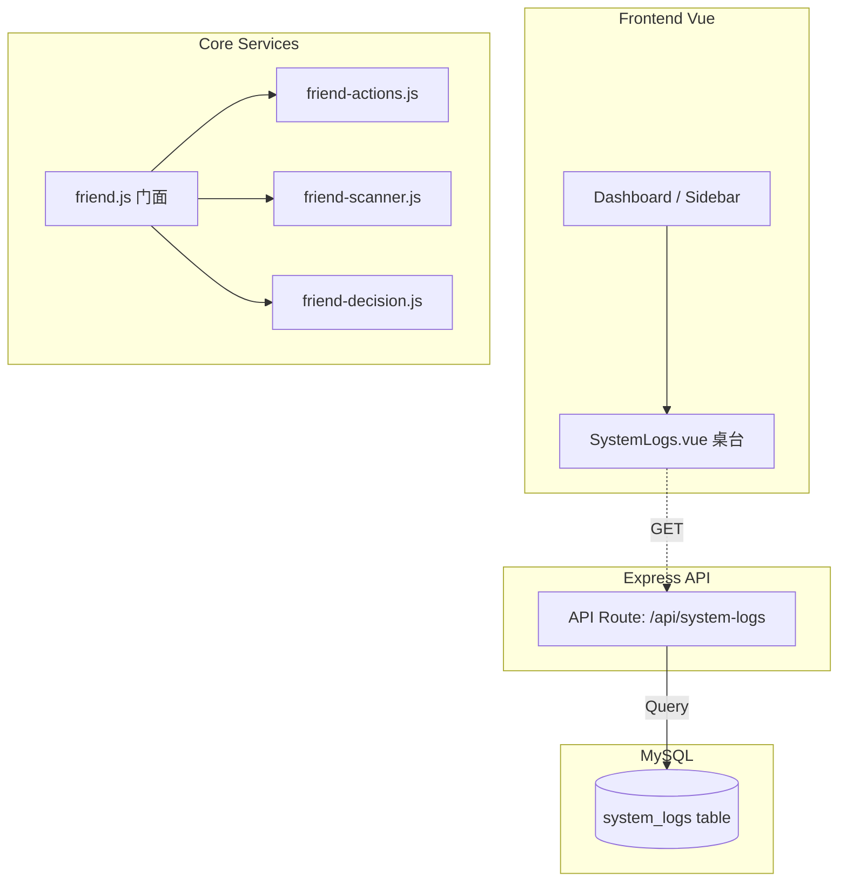

# DESIGN: 农场系统演进 Phase 3

## 1. 重构架构设计 (`friend.js` 拆分解构)

摒弃大泥球，转向**组合/委托模式**：
- `friend-scanner.js`: 专注负责轮询、间隔控制（Jitter/Backoff）和获取朋友列表结构。
- `friend-actions.js`: 只保留独立原子操作（偷、浇水、除草、下毒），并抛出日志记录。
- `friend-decision.js`: （决策大脑）判断谁需要偷、谁优先、三阶段模式的核心判断。
- `friend.js`: 退化成为 Façade (门面模式) 入口，拼装上述三个模块并暴露原有接口，外部依然只 import `core/src/services/friend.js`。

## 2. 日志审计台全栈链路

### 2.1 Backend API 层
新增 `logs.js` 服务文件与 Express Route：
`GET /api/system-logs?page=1&limit=50&level=warn&accountId=xxx&keyword=偷菜`
- 拼装 SQL `WHERE 1=1` 动态附加 AND 条件。
- 使用 `COUNT(*)` 提供总页数支持。

### 2.2 Frontend UI 层
- 在前端增加一个新的 `SystemLogs.vue` 组件，或者整合在侧边栏/设置页的一个弹层中。
- 内置过滤栏：日期范围、类型选择器（Info/Warn/Error/Safe）、模糊搜索输入框。
- 下方使用 Ant Design Vue 的 `<a-table>` 进行分页展示。

## 3. 依赖关系图

