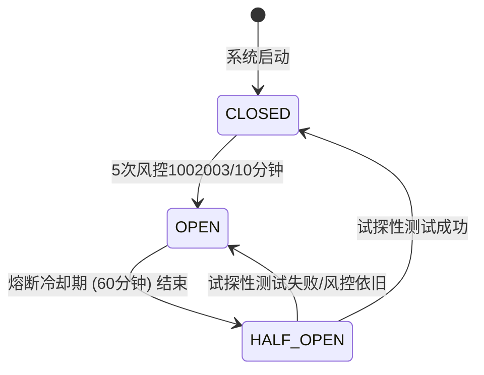

# 架构设计文档 (DESIGN) - 农场系统演进 Phase 4

## 1. 全局风控熔断器 (Automated Circuit Breaker)
### 设计理念
在传统的服务调用中，当底层服务高频抛出异常资源不足时，熔断器打开阻止继续雪崩。在农场脚本里，“风控异常”（1002003 / 验证码弹窗）是致命毒药，一旦被察觉还在挂机发包，极易永久封号。

### 实现模块: `core/src/services/circuit-breaker.js` (NEW)
- **State**: `failuresCount` (时间窗内), `state` (CLOSED, HALF_OPEN, OPEN), `lastResetTime`
- **Hook**: 挂载到 `network.js` 的错误拦截器中，以及 `friend-scanner.js` 连续失败的计步器上。
- **Action**: 当 `state === OPEN` 时，修改 `globalConfig.runMode = 'paused'`，并通过 `push.js` 模块发射 Webhook 告警。

## 2. 数据大屏可视化 (Vue Echarts 接入)
### 设计理念
用户迫切需要一个炫酷或者极简的界面看到昨天到底偷到了多少，以及挂机的收益走势。

### 实现模块
- **依赖**: VITE 环境下，在 `web/package.json` 引入 `echarts` 和 `vue-echarts`。
- **后台**: `core/src/controllers/admin.js` 开设 `/api/stats/trend` 接口，聚合查询 MySQL 中 `stats` 每小时/每天的数据集。
- **前台**: 建立 `web/src/views/AnalyticsEcharts.vue`。

## 3. Farm Tools API 路由大扫除
### 设计理念
微服务化的外壳。`admin.js` 作为控制面主入口，应该只保持 Auth、Sys、中台设置相关的路由。具体的经验计算、作物推演业务直接外包给新的 Controller。

### 实现模块
- **新建**: `core/src/controllers/farm-tools-routing.js`
- **重构**: 利用 `express.Router()`。
- **改绑**: 在 `admin.js` 中使用 `app.use('/api/tools', require('./farm-tools-routing'))`，并通知前端相应页面替换 API 前缀为空。
