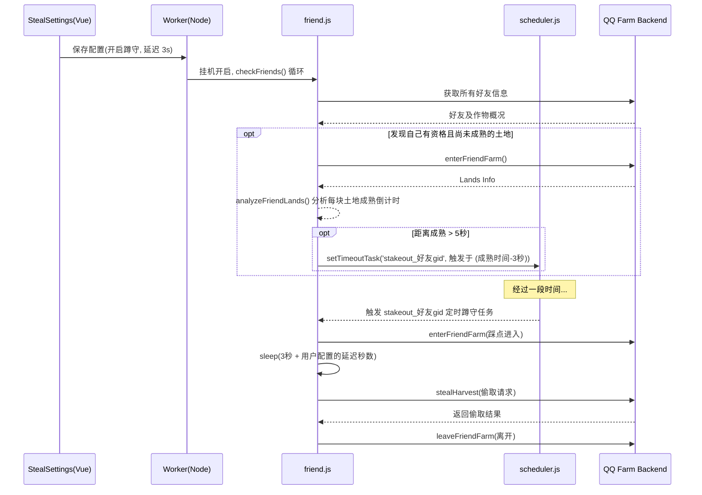

# DESIGN: 蹲守偷菜功能架构设计

## 1. 整体流程序列图



## 2. 数据结构变化
**`models/store.js`** 的 `automation` 配置对象新增：
```json
{
  "stakeout_steal": true,
  "stakeout_delay": 3
}
```

## 3. 代码模块设计
1. **`core/src/services/friend.js`**:
   - `analyzeFriendLands`: 扩充返回的 `summary` 的数据，把未成熟但可以作为蹲守目标的地块加入返回列表（`upcomingMature: [{landId, matureInSec, plantId}]`）。目前已计算出 `matureInSec`。需要对黑白名单 `shouldStealPlant(plantId)` 和 `shouldStealFriend(gid)` 进行校验后过滤。
   - `checkFriends` 循环：在拿到 `status.upcomingMature` 时，如果开启了 `stakeout_steal`，就按最快的那个果实的 `matureInSec` 减去 3 秒，建立 `setTimeoutTask`。
   - 新增方法 `runStakeoutSteal(friendGid, landIds, waitSec, delaySec, name)`。
     被触发时：`await enterFriendFarm` -> `sleep(waitSec + delaySec)` -> `stealHarvest` -> 记录并离开 -> `leaveFriendFarm`。
     （此处应加入一层时间判定，如果是很长时间之后成熟的就不安排）。
2. **`web/src/views/StealSettings.vue`**:
   - 在 UI 顶部（搜索框和 Mode 这一层，或者作为一个配置卡片）增加“蹲守偷菜”开关以及秒数输入框。
3. **`web/src/stores/setting.ts` （无需修改直接透传）**:
   - 因为已经是 `Object.assign(fullSettingsToSave.automation, localSettings.value.automation)` 所以前端只要增加 `localSettings.value.automation.stakeoutEnabled` 和 `stakeoutDelayNum`。
