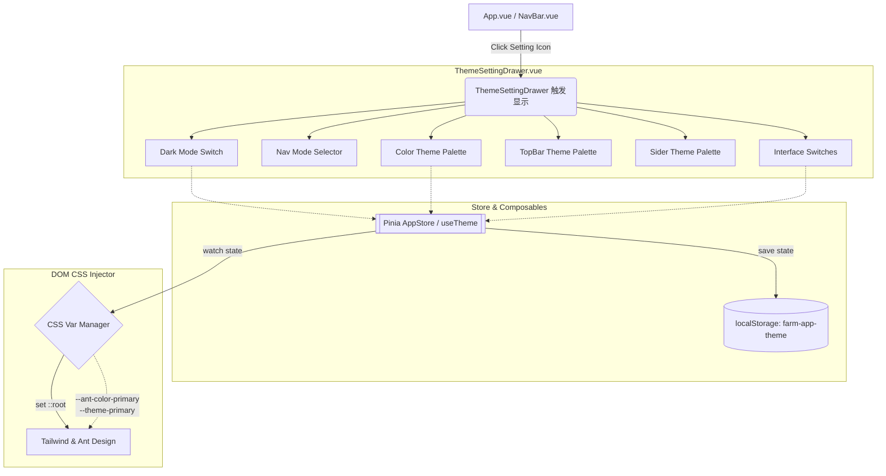

# 阶段 2: Architect (架构) - 侧边栏主题切换重构

## 1. 架构目标
将原有的简单色彩切换（左侧主题球）重构为一个**全局可访问、右侧抽屉式展示、高扩展性的系统配置面板**（ThemeSettingDrawer），实现 Vue + Ant Design Vue + Tailwind CSS 的深层变量代理与状态持久化。

## 2. 核心架构图 (Mermaid)



## 3. 模块职责与依赖
### 3.1 `ThemeSettingDrawer.vue` (新建/重构)
- **职责**：整个“项目配置”面板的核心载体。基于 `<a-drawer>` 组件封装。
- **依赖**：依赖全局 Store 以获取/修改状态；依赖 Ant Design Vue UI 基础组件。

### 3.2 状态管理 (Store)
- 需要维护的全局可持久化状态接口：
  - `isDark` (boolean): 是否开启黑夜模式。
  - `themeColor` (string): 主题 Hex 颜色值。
  - `navMode` (string): 'side' | 'top' 等（目前可能只是预留UI）。
  - 各类功能开关：`showBreadcrumb`, `showTabs` 等。

### 3.3 CSS 变量渲染与覆盖机制
现有的 Tailwind/UnoCSS 需要被引导至使用 CSS 变量：
```css
:root {
  --theme-primary: #22c55e; /* Default 御农翠绿 */
}
```
并且在 JS 切换时动态执行：
```js
document.documentElement.style.setProperty('--theme-primary', colorHex);
```
对于 Ant Design Vue（如果在用 V4 ConfigProvider），需要通过 `ConfigProvider` 传入 `theme: { token: { colorPrimary: hex } }` 进行双向强绑定。

## 4. 复用策略与风险控制
- **复用**：已有的 `dark` class 切换逻辑、本地存储逻辑。
- **风险**：若大面积替换 Tailwind 硬编码颜色值（如原先写死的 `bg-green-500`），将涉及多文件重构。为保持稳定性，“Make it work”，我们将优先用全局 CSS 变量挂载方式，利用 Tailwind 的 `extend colors` 绑定到 `--theme-primary`，然后在全局进行部分替换（如 `.bg-primary`）。

## 5. 输出契约
1. 新建组件 `src/components/ThemeSettingDrawer.vue`（基于之前生成的 HTML UI）。
2. 在右上角注入一个齿轮配置入口（全局注入）。
3. 建立专门的 `useTheme.js` composable 来聚合这些更改。
